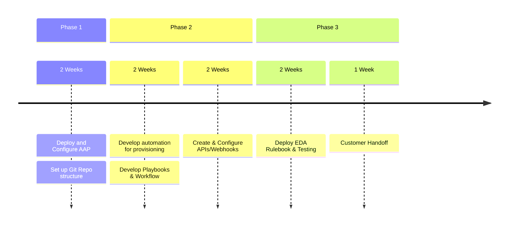

---
tags:
  - EventNotes
Event: "[[Ansible Automation Bootcamp]]"
Date: 2025-10-22
End Date: 2025-10-23
Event Type: Project
Speaker:
Website:
cssclasses:
  - wide-page
---
# Prompt - Initial OS Baseline Baremetal Setup
## Core Objective
Develop strategy for automating the initial OS baseline
setup of baremetal servers and integrate it into the
customers ITSM platform
### Customer Assumptions
- Customer recycles the baremetal server
hardware every 3 years automatically
- Customer receives the hardware with no notice
and has a warehouse full of them waiting to be
swapped
- All the information about the hardware swap is in
an ITSM ticket (name, purpose, IP, iDrac IP,
configuration, etc)
- Customer expects to use the same gold image,
just implement different app requirements

# Resources
Private link for Google Presentation:
https://docs.google.com/presentation/d/1ojwF2MvQR0BcpCtyBuUmXA-CcS2BXUEF5jbwYvohhx4/edit?usp=sharing

# Presentation Overview
## Pain Points
- Hardware lifecycle is manual, slow, and painful to complete
- Existing process requires many teams to consistently work together
- Fulfilling OS requirements manually from ITSM is prone to human error

## Our Assumptions of the Customer
- Customer is responsible for hardware’s required connectivity for OS installation
- ITSM ticket has all required, correct information
- Hardware that is not compatible with golden image is out of scope
- Customer has a golden image that is up to standards within their organization
- Infrastructure to deploy AAP is ready. Installing AAP is in the scope of the project.
- Customer will provide a full-time technical resource to collaborate with the Red Hat team and own the process when the engagement is complete
- Customer will provide a full-time resource (Project Manager) to assist in project goals
- Customer iDrac/server management is compatible with Ansible modules
- Customer has a version control server
- Inventory can be sourced from ITSM

## High Level Automation Strategy
- Use Ansible Automation Platform
- Develop Ansible automation for server provisioning, using EDA to launch workflow
- Event trigger to kickoff golden image install and configure based on data in ITSM ticket 
- Automation will update ITSM ticket as workflow tasks are performed

## Scope
### Resources
- 4 Consultants
- 1 Architect
- 1 Project Manager

### Tasks within Scope
- AAP installation
- Configure Hardware (including Firmware) 
- Install OS
- EDA with ITSM
- AAP (all of it)
- Gather App requirements
- USE golden image, not maintain
- Craft communication strategy
- CI/CD (including version control)

## Timeline

## Content Development Strategy
1. Create GitLab repository
2. Create dynamic inventories sourced from ServiceNow
3. Develop playbooks (covered in next slides)
4. Create workflow

### AAP Workflow

>[!note]
>Convert to AAP workflow screenshot
>Workflow launched by EDA

1. ITSM ticket details as extra_vars > create DNS records
2. Golden Image based on OS 
3. Branches to different playbook depending on application 
4. Close/update ITSM ticket
5. Sync corresponding inventory

